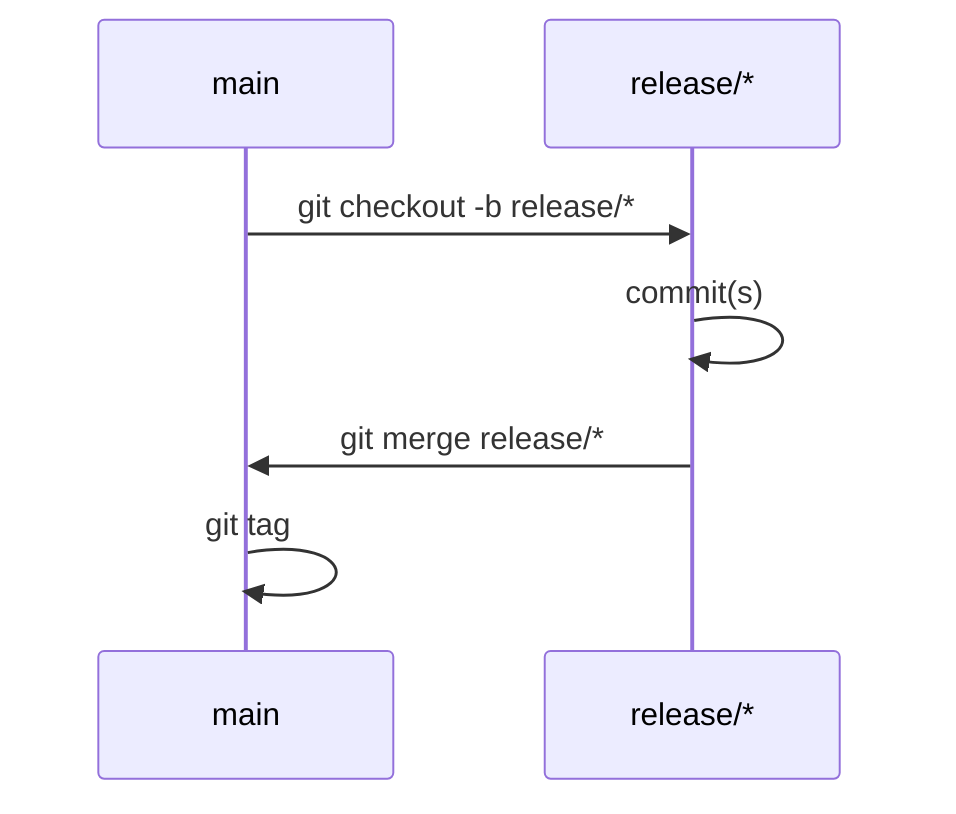

# cloud-tek/build

This repository contains 3 packages used internally by CloudTek:

- [CloudTek.Build](./docs/cloud-tek.build.md)
- [CloudTek.Testing](./docs/cloud-tek.testing.md)
- [CloudTek.Git](./docs/cloud-tek.git.md)

## Build process

## Test
